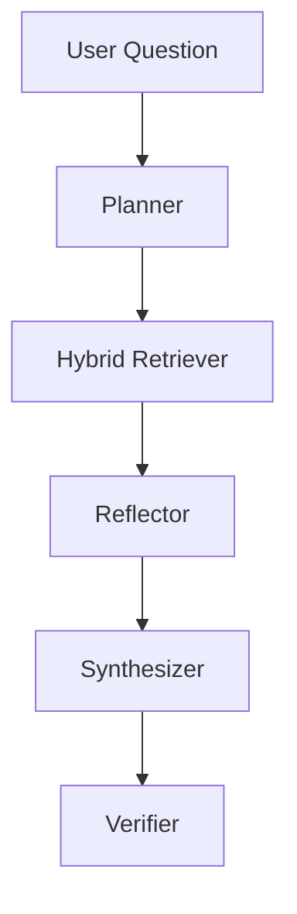

# Agentic Deep Research

An agentic deep-research system over a corpus of recent LLM-agent papers (arXiv, cs.CL/AI/LG, Jan 2024–Apr 2026).


## Current Status

- 63 processed arXiv papers
- PyMuPDF-based PDF parsing
- Hybrid retrieval (BM25 + ChromaDB)
- Reciprocal Rank Fusion
- Cross-encoder reranking
- Planner, Reflector, Synthesizer, and Verifier agents
- Automated evaluation pipeline with multiple ablations

During development, Groq API rate limits significantly increased evaluation runtime. The retrieval and agent pipelines are functional, while large-scale evaluation is still being expanded.


## Architecture

## Architecture



## Tech Stack

| Component | Choice | Why |
|-----------|--------|-----|
| LLM (plan/synth) | Groq Llama 3.3 70B | Free tier, fast, strong reasoning |
| LLM (reflect/verify) | Groq Llama 3.1 8B | Low latency, sufficient for binary decisions |
| Embeddings | BAAI/bge-small-en-v1.5 | Strong performance, runs on CPU |
| Vector store | ChromaDB (persistent) | Free, local, no credit card |
| Lexical index | BM25Okapi (rank_bm25) | Exact term matching for paper IDs/names |
| Fusion | Reciprocal Rank Fusion | Parameter-free, robust combination |
| Reranker | cross-encoder/ms-marco-MiniLM-L-6-v2 | Best precision for top-20 reranking |
| Chunking | RecursiveCharacterTextSplitter (400 tok, 80 overlap) | Preserves sentence boundaries |
| PDF parsing | PyMuPDF | Fast, handles arXiv PDFs well |

## Setup

```bash
# 1. Clone & install
git clone <repo>
cd <repo>
pip install -r requirements.txt

# 2. Set Groq API key (free at console.groq.com)
export GROQ_API_KEY=gsk_your_key_here

# 3. Run everything (runtime depends heavily on Groq API rate limits and corpus size).
python run_pipeline.py --phase all
```

## Step-by-step

```bash
# Just scrape
python run_pipeline.py --phase scrape

# Just build index (after scrape)
python run_pipeline.py --phase index

# Run one config
python run_pipeline.py --phase run --config full_agent

# Run all configs (full_agent + baseline + 5 ablations)
python run_pipeline.py --phase run

# Evaluate all
python run_pipeline.py --phase eval
```

## Ablation configs

| Config | Planner | Reranker | Reflector | Hybrid | Verifier |
|--------|---------|----------|-----------|--------|----------|
| full_agent | ✓ | ✓ | ✓ | ✓ | ✓ |
| baseline | ✗ | ✗ | ✗ | ✗ | ✗ |
| no_planner | ✗ | ✓ | ✓ | ✓ | ✓ |
| no_reranker | ✓ | ✗ | ✓ | ✓ | ✓ |
| no_reflector | ✓ | ✓ | ✗ | ✓ | ✓ |
| no_hybrid | ✓ | ✓ | ✓ | ✗ | ✓ |
| no_verifier | ✓ | ✓ | ✓ | ✓ | ✗ |

## Output files

```
predictions/
  full_agent.jsonl
  baseline.jsonl
  no_planner.jsonl
  no_reranker.jsonl
  no_reflector.jsonl
  no_hybrid.jsonl
  no_verifier.jsonl

eval/results/
  full_agent_scores.json
  full_agent_summary.json
  ...
```

## Key hyperparameters (all in config.py)

- `CHUNK_SIZE` = 400 tokens, `CHUNK_OVERLAP` = 80
- `TOP_K_DENSE` = 50, `TOP_K_BM25` = 50 → fused to top 20 → reranked to top 8
- `MAX_ITERATIONS` = 5 (reflector loop cap)
- `MIN_EVIDENCE_CHUNKS` = 6 (reflector early stop)


## Author
Avishi Agarwal
